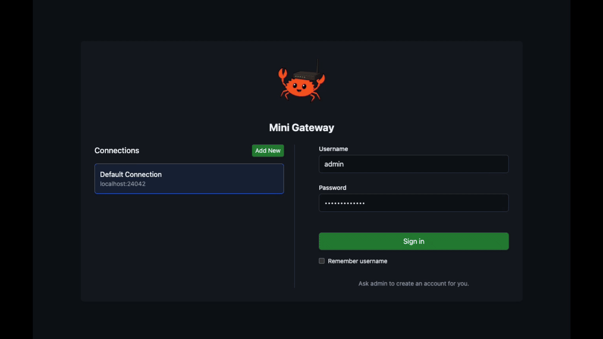
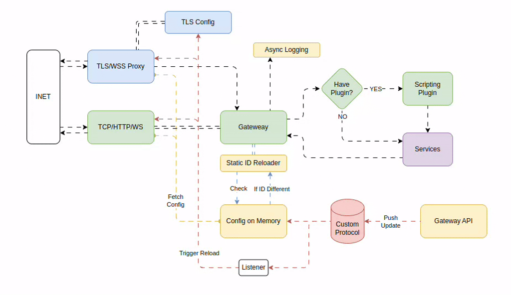

# Mini Gateway

 
mini gateway 
A very fast yet easy to control Gatway!

### Adopters

> 👋 Using Mini-Gateway at your company? \
> We’d love to know! If you're using Mini-Gateway in production, please reach out \
> we’d be honored to list your logo on `gateway.rs` as a user. \
> (open a PR to add your proof of usage and your logo!)

## Table of Contents

- [Introduction](#introduction)
- [Architecture](#architecture)
- [Roadmap](#roadmap)
  - [Control Center](#control-center)
  - [Core Features](#core-features)
  - [Other Features](#other-features)
- [Documentation](#documentation)
- [Getting Started](#getting-started)
- [Sub-repositories](#sub-repositories)
  - [Sub-repository Overview](#sub-repository-overview)
- [Connectivity and Network Requirements](#connectivity-and-network-requirements)

## Introduction

It is designed to be easy to use and configure, making it suitable for both small and large-scale applications. The mini-gateway is built with a focus on performance, security, and flexibility, allowing users to customize their routing and proxying needs.

## Architecture

The architecture of the mini-gateway is currently simple and straightforward.

> Incoming traffic enters from the internet and is first secured by the TLS/WSS proxy, which decrypts the data and passes it as TCP/HTTP/WS traffic (while you can disable the TLS if not needed). This standardized traffic is then processed by the Gateway, which dynamically determines whether to pass the request through a scripting plugin or directly to backend services. In parallel, a background mechanism constantly monitors for configuration changes. When updates are detected—via the Gateway API and an external update service—these are reloaded in memory to ensure the Gateway operates with the latest settings, all without interrupting the flow.

## Roadmap

### Control Center
- [x] Web GUI - Control Panel
- [ ] Web GUI - Live Monitoring
- [ ] CLI - Control Panel
- [ ] CLI - Live Monitoring (looks like htop)
- [ ] Robust Logging integration

### Core Features
- [x] (proxy)   HTTP/HTTPS
- [x] (proxy)   HTTP Host Lock
- [x] (proxy)   Websocket
- [x] (proxy)   Dynamic Target
- [x] (gateway) Dynamic Routing
- [x] (gateway) Advanced routing path using regex 
- [ ] Auto Renew SSL (let's encrypt)
- [ ] Scripting Plugin

### Other Features
- for requested features please create issue.

## Documentation

api documentation can be found [here](https://github.com/zonblade/mini-gateway-rs/blob/main/router-api/README.md) , installation not yet ready but will be available both docker and apt-repository.

## Getting Started

for manual build guideline please refer to each dockerfiles in [here](https://github.com/zonblade/mini-gateway-rs/tree/main/build-docker) but we provide docker and binary:
- for the docker you can get it [here on dockerhub](https://hub.docker.com/r/zonblade/mini-gateway/tags)
- for the binary you can check our github release 

## Sub-repositories

Each sub-repository within this project is designed to be standalone. This means that they are independent modules and should be run separately. Ensure that you configure and execute each sub-repo according to its specific requirements and purpose. Refer to the documentation within each sub-repo for detailed setup and usage instructions.

### Sub-repository Overview

| Sub-repository | Description                                                                 | Notes                                                                                     |
|----------------|-----------------------------------------------------------------------------|-------------------------------------------------------------------------------------------|
| `router-core`  | Core proxy service responsible for handling traffic routing and forwarding. | Must run in a private/secure network.       |
| `router-api`   | Provides an API interface for managing and configuring the router.          | Intended for internal use only. Not designed for external consumption.                    |
| `router-cli`   | Command-line interface for interacting with and managing the router.        | Useful for quick configuration and debugging.                                             |
| `router-gui`   | Graphical user interface for managing the router.                          | Designed for internal use. Should not be exposed to public networks.                      |

## Connectivity and Network Requirements

- The system must operate within a private and secure network. Exposing the applications or the database to public networks is not recommended and could lead to security vulnerabilities.
- The API or GUI provided by the system is intended strictly for internal use and is not designed for external consumption. Ensure that access is restricted to authorized users within the secure network.
