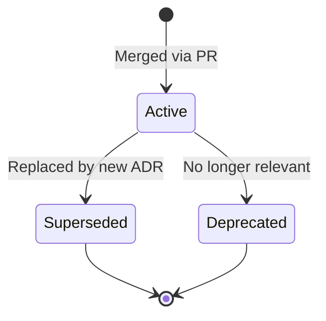

# ADR-0001: ADR Process

## Date

2026-03-29

## Context

As we begin contributing to the mini-gateway-rs CLI (completing the Control Panel and Live Monitoring roadmap items), we need a structured way to document architectural decisions. The project has several non-obvious design choices (custom Pingora fork, UDP logging with accepted packet loss, custom ProTTP protocol) but no formal record of why these decisions were made.

Without documented decisions, contributors risk re-litigating settled questions or making changes that conflict with the original design intent. ADRs provide a lightweight way to capture the "why" behind architectural choices so that future contributors can understand the reasoning.

## Architecture

## Decision

We adopt Architecture Decision Records following the Michael Nygard format, extended with mandatory Mermaid diagrams for any decision involving component interaction or data flow.

### Format

Each ADR is a Markdown file in `docs/adr/` named `NNNN-short-title.md` where `NNNN` is a zero-padded sequential number. The file follows the template at `docs/adr/template.md` with these sections:

- **Date**: When the ADR was created (YYYY-MM-DD)
- **Context**: The problem or situation driving the decision
- **Architecture**: Mermaid diagram(s) visualizing the relevant structure or flow
- **Decision**: What we decided and why
- **Consequences**: Positive, negative, and risk impacts
- **Alternatives Considered**: Other options and why they were rejected
- **References**: Links to related ADRs, issues, or external resources

### Rules

1. ADRs are numbered sequentially starting from 0001.
2. An ADR is considered active once its PR is merged. The PR review process serves as the approval mechanism.
3. ADRs are immutable once merged. New decisions that override old ones create a new ADR and add a "Superseded by ADR-NNNN" note at the top of the original.
4. Mermaid diagrams are required for any ADR that involves component interaction, data flow, or state transitions.
5. The `docs/adr/README.md` index must be updated when any ADR is added.

## Consequences

### Positive

- Architectural decisions are discoverable and searchable in the repository.
- New contributors can understand the "why" behind design choices without asking the original author.
- Mermaid diagrams render natively on GitHub, providing visual context alongside text.

### Negative

- Adds a documentation step before implementation, which costs time upfront.
- ADRs can become stale if not maintained when decisions are revisited.

### Risks

- Over-documentation: not every small decision needs an ADR. Reserve them for decisions that affect module boundaries, dependency choices, protocol design, or data flow.

## Alternatives Considered

**No formal process**: Rely on commit messages and PR descriptions. Rejected because these are scattered and hard to discover after the fact.

**Wiki-based documentation**: Use GitHub Wiki. Rejected because it lives outside the repository, cannot be reviewed in PRs, and is easy to lose sync with the code.

**RFCs**: More heavyweight than needed for this project's size and contributor count.

## References

- [Michael Nygard's ADR format](https://cognitect.com/blog/2011/11/15/documenting-architecture-decisions)
- [Mermaid diagram syntax](https://mermaid.js.org/intro/)
