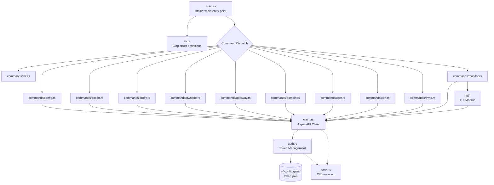
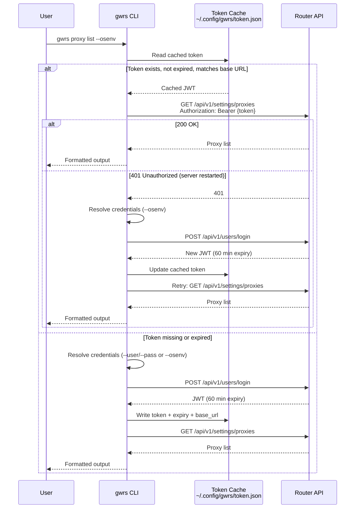
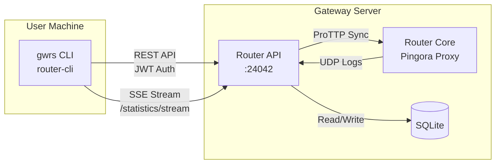

# ADR-0002: CLI Architecture Redesign

## Date

2026-03-29

## Context

The current `router-cli` crate is a single `main.rs` file (~405 lines) with three commands (`init`, `config`, `export`). The project roadmap requires two major features:

1. **CLI Control Panel**: CRUD management for proxies, gateways, domains, users, certificates, and sync.
2. **CLI Live Monitoring**: An htop-like TUI dashboard streaming real-time statistics.

The existing architecture cannot support this growth:

- **Monolithic file**: All logic (CLI parsing, auth, HTTP calls, config generation) lives in one file. Adding 30+ API operations here would be unmanageable.
- **Synchronous HTTP**: Uses `ureq` (blocking). The gateway/proxy domain is inherently I/O-bound; serving high traffic means the system must handle many concurrent I/O operations. Async allows firing multiple operations and processing whichever completes first, the same principle that makes ASGI superior to WSGI for I/O-bound workloads. The TUI also requires concurrent SSE streaming, keyboard events, and UI refresh.
- **No shared API client**: Each function manually constructs HTTP requests and parses responses with duplicated auth header injection.
- **No structured errors**: Uses `anyhow::bail!` everywhere, making error recovery (e.g., auto re-auth on 401) impossible to implement cleanly.
- **No token caching**: Every command invocation re-authenticates, adding latency and unnecessary load on the API.

## Architecture

### Module Structure



### Proposed Directory Layout

```
router-cli/src/
  main.rs                 -- #[tokio::main], parse CLI, dispatch to commands
  cli.rs                  -- Clap structs (Cli, Commands, subcommand enums)
  client.rs               -- ApiClient: async reqwest wrapper with auth
  auth.rs                 -- Credential resolution, token cache read/write
  error.rs                -- CliError enum (thiserror)
  output.rs               -- Output formatting (table/json/yaml)
  commands/
    mod.rs
    init.rs               -- Scaffold config YAML (local, no API call)
    config.rs             -- Upload YAML config
    export.rs             -- Download YAML config
    proxy.rs              -- Proxy CRUD (ADR-0003)
    gwnode.rs             -- Gateway node CRUD (ADR-0003)
    gateway.rs            -- Gateway routing CRUD (ADR-0003)
    domain.rs             -- Proxy domain CRUD (ADR-0003)
    user.rs               -- User management (ADR-0003)
    cert.rs               -- Certificate operations (ADR-0003)
    sync.rs               -- Sync triggers (ADR-0003)
    monitor.rs            -- TUI entry point (ADR-0004)
  tui/                    -- TUI module (ADR-0004)
    mod.rs
    app.rs                -- Application state + ring buffer
    event.rs              -- Event multiplexer (SSE, keyboard, tick)
    ui.rs                 -- Layout and rendering
```

### Authentication Flow



### System Context (CLI within mini-gateway-rs)



## Decision

### 1. Fully async with reqwest

Replace `ureq` (sync) with `reqwest` (async) for all commands. The gateway/proxy domain is inherently I/O-bound. Async allows firing multiple I/O operations concurrently and processing whichever completes first, the same principle as ASGI. Even for simple CRUD commands, this enables batch operations and concurrent resource fetches without blocking. The TUI monitoring requires async for multiplexing SSE streams, keyboard events, and UI ticks. Using a single async HTTP client avoids maintaining two dependencies.

**Dependency changes in `router-cli/Cargo.toml`:**
- Remove: `ureq`
- Add: `reqwest` (with `json`, `stream` features)
- Keep: `tokio` (already present, now actively used with `#[tokio::main]`)

### 2. Module decomposition

Split the monolithic `main.rs` into the module structure shown above. Each command gets its own file under `commands/`. Shared infrastructure (API client, auth, errors, output formatting) lives in the crate root.

### 3. Shared async API client

A single `ApiClient` struct in `client.rs` encapsulates:
- `reqwest::Client` instance (connection pooling, keep-alive)
- Base URL
- JWT token (set after authentication)
- Methods: `get()`, `post()`, `post_json()`, `delete()` that inject the Authorization header and return `Result<T, CliError>` where T is deserialized from JSON

### 4. Token caching

Cache the JWT to `~/.config/gwrs/token.json` (using the `dirs` crate already in Cargo.toml):

```json
{
  "token": "eyJ...",
  "expires_at": "2026-03-29T14:30:00Z",
  "base_url": "http://localhost:24042"
}
```

Rules:
- Read cache on startup; use if not expired (with 5-minute safety margin) and base URL matches
- On 401 response: clear cache, re-authenticate once, retry the request
- `--no-cache` flag to force fresh authentication
- The API generates a new JWT secret on each server restart, so cached tokens may be invalidated at any time

### 5. Structured error types

Replace `anyhow::bail!` with a `thiserror` enum:

```rust
#[derive(Debug, thiserror::Error)]
pub enum CliError {
    #[error("authentication failed: {0}")]
    Auth(String),
    #[error("API error ({status}): {message}")]
    Api { status: u16, message: String },
    #[error("network error: {0}")]
    Network(#[from] reqwest::Error),
    #[error("config error: {0}")]
    Config(String),
    #[error("IO error: {0}")]
    Io(#[from] std::io::Error),
    #[error("YAML error: {0}")]
    Yaml(#[from] serde_yaml::Error),
    #[error("JSON error: {0}")]
    Json(#[from] serde_json::Error),
}
```

This enables pattern matching on error variants (e.g., catching `Api { status: 401, .. }` for auto re-auth).

## Consequences

### Positive

- Each command is isolated in its own module, making review and testing straightforward.
- Single async runtime and HTTP client for all commands, consistent programming model.
- Token caching reduces latency for repeated CLI invocations.
- Structured errors enable programmatic error handling (auto re-auth, retry logic).
- The module structure naturally accommodates future commands without touching existing code.

### Negative

- Async adds syntactic overhead (`async fn`, `.await`) to simple one-shot commands.
- Replacing `ureq` with `reqwest` changes the existing working code, requiring careful migration.
- Token cache file introduces a side effect (filesystem state) that users may not expect.

### Risks

- **Token cache security**: The cached JWT is stored in plaintext. On multi-user systems this could be a concern. Mitigated by: file permissions (0600), the token expires in 60 minutes, and the `--no-cache` flag opts out entirely.
- **reqwest binary size**: `reqwest` with TLS pulls in more dependencies than `ureq`. Monitor the release binary size after migration.

## Alternatives Considered

**Keep ureq for CRUD, add reqwest only for TUI**: Avoids changing working code but results in two HTTP client dependencies doing the same job. Rejected for the inconsistency and maintenance burden.

**Use hyper directly**: Maximum control but massive boilerplate for simple REST calls. Rejected; `reqwest` provides the right abstraction level.

**Keep the monolithic main.rs**: Could work with careful organization (regions, helper functions) but does not scale past ~10 commands and makes code review painful. Rejected.

## References

- [ADR-0001](0001-adr-process.md): ADR Process
- [ADR-0003](0003-cli-control-panel.md): CLI Control Panel (depends on this architecture)
- [ADR-0004](0004-cli-live-monitoring.md): CLI Live Monitoring (depends on this architecture)
- router-cli/src/main.rs: Current CLI implementation
- router-api/README.md: API endpoint documentation
