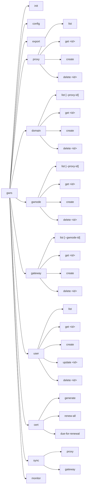
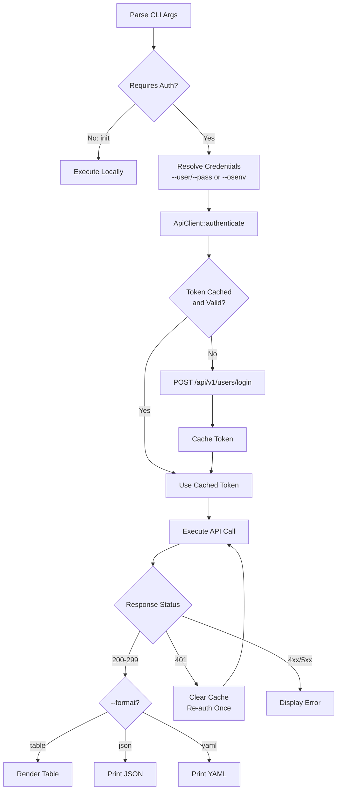
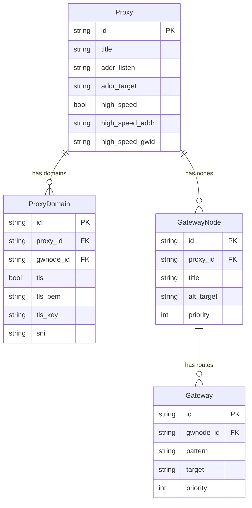

# ADR-0003: CLI Control Panel

## Date

2026-03-29

## Context

The project roadmap includes "CLI - Control Panel" as an incomplete feature. Currently, the CLI only supports bulk config upload/download via YAML files (`gwrs config` and `gwrs export`). There is no way to manage individual resources (proxies, gateways, domains, users, certificates) from the command line.

The Router API exposes 30+ REST endpoints for granular resource management, but these are only accessible via the Web GUI or direct HTTP calls. Operators who prefer terminal workflows or need to script gateway management have no tool for this.

This ADR defines the command structure, output formatting, and interaction patterns for the CLI Control Panel. It depends on the architecture established in [ADR-0002](0002-cli-architecture-redesign.md).

## Architecture

### Command Tree



### CRUD Operation Flow



### Data Model Relationships



## Decision

### 1. Command hierarchy

Each API resource gets a top-level subcommand with standard CRUD operations:

| Command | API Endpoint | Method |
|---------|-------------|--------|
| `gwrs proxy list` | `/api/v1/settings/proxies` | GET |
| `gwrs proxy get <id>` | `/api/v1/settings/proxy/{id}` | GET |
| `gwrs proxy create` | `/api/v1/settings/proxy` | POST |
| `gwrs proxy delete <id>` | `/api/v1/settings/proxy/{id}` | DELETE |
| `gwrs domain list [--proxy-id <id>]` | `/api/v1/settings/proxydomain/list[/{proxy_id}]` | GET |
| `gwrs domain get <id>` | `/api/v1/settings/proxydomain/{id}` | GET |
| `gwrs domain create` | `/api/v1/settings/proxydomain/set` | POST |
| `gwrs domain delete <id>` | `/api/v1/settings/proxydomain/delete` | POST |
| `gwrs gwnode list [--proxy-id <id>]` | `/api/v1/settings/gwnode/list[/{proxy_id}]` | GET |
| `gwrs gwnode get <id>` | `/api/v1/settings/gwnode/{id}` | GET |
| `gwrs gwnode create` | `/api/v1/settings/gwnode/set` | POST |
| `gwrs gwnode delete <id>` | `/api/v1/settings/gwnode/delete` | POST |
| `gwrs gateway list [--gwnode-id <id>]` | `/api/v1/settings/gateway/list[/{gwnode_id}]` | GET |
| `gwrs gateway get <id>` | `/api/v1/settings/gateway/{id}` | GET |
| `gwrs gateway create` | `/api/v1/settings/gateway/set` | POST |
| `gwrs gateway delete <id>` | `/api/v1/settings/gateway/delete` | POST |
| `gwrs user list` | `/api/v1/users/admin` | GET |
| `gwrs user get <id>` | `/api/v1/users/{id}` | GET |
| `gwrs user create` | `/api/v1/users/admin` | POST |
| `gwrs user update <id>` | `/api/v1/users/{id}` | PUT |
| `gwrs user delete <id>` | `/api/v1/users/{id}` | DELETE |
| `gwrs cert generate` | `/api/v1/settings/certificates/generate` | POST |
| `gwrs cert renew-all` | `/api/v1/settings/certificates/renew-all` | POST |
| `gwrs cert due-for-renewal` | `/api/v1/settings/certificates/due-for-renewal` | GET |
| `gwrs sync proxy` | `/api/v1/sync/proxy` | POST |
| `gwrs sync gateway` | `/api/v1/sync/gateway` | POST |

### 2. Output formatting

A global `--format` flag controls output format:

- `table` (default): Human-readable aligned columns. No external crate needed; formatted with `println!` and padding.
- `json`: Machine-readable, piped to `jq` or consumed by scripts. Uses `serde_json::to_string_pretty`.
- `yaml`: For users who prefer YAML. Uses `serde_yaml::to_string`.

Example:
```
$ gwrs proxy list --format table
ID                                    TITLE       LISTEN          HIGH_SPEED
a1b2c3d4-e5f6-7890-abcd-ef1234567890  web-proxy   0.0.0.0:443     true
f0e1d2c3-b4a5-6789-0abc-def123456789  api-proxy   0.0.0.0:8080    false

$ gwrs proxy list --format json
[
  {
    "id": "a1b2c3d4-e5f6-7890-abcd-ef1234567890",
    "title": "web-proxy",
    ...
  }
]
```

### 3. Destructive operation confirmation

Delete commands prompt for confirmation by default:

```
$ gwrs proxy delete a1b2c3d4
Are you sure you want to delete proxy 'a1b2c3d4'? [y/N]: y
Proxy deleted (2 domains removed, 1 node unbound).
```

The `--yes` / `-y` flag skips the prompt for scripting:

```
$ gwrs proxy delete a1b2c3d4 --yes
Proxy deleted (2 domains removed, 1 node unbound).
```

### 4. Backward compatibility

The existing `init`, `config`, and `export` commands remain unchanged in behavior. They are the bulk-operation entrypoints. The new CRUD commands are purely additive.

### 5. Proxy create: composite input

The API's `POST /settings/proxy` accepts a `ProxyInputObject` containing both proxy fields and an array of domains. The CLI mirrors this:

```
gwrs proxy create \
  --title "web-proxy" \
  --listen "0.0.0.0:443" \
  --domain "example.com" \
  --domain "api.example.com" \
  --high-speed \
  --high-speed-target "gwnode-id"
```

Each `--domain` flag adds a `ProxyDomain` entry. If no `--domain` is provided, the proxy is created without domains.

## Consequences

### Positive

- Full gateway management from the terminal without needing the Web GUI or curl.
- Scriptable: `--format json` + `--yes` flags enable automation and CI/CD integration.
- Consistent UX: every resource follows the same `list/get/create/delete` pattern.
- Backward compatible: existing workflows using `gwrs config` and `gwrs export` are unaffected.

### Negative

- Large surface area: 25+ commands to implement, test, and document.
- The CLI must mirror API response types, creating a coupling that requires updates when the API changes.

### Risks

- **API drift**: If the Router API adds or changes endpoints, the CLI must be updated to match. Mitigated by keeping API response types in a shared location within the CLI crate.
- **Permission errors**: Some commands require admin role. The CLI should surface clear error messages when a non-admin user attempts admin-only operations.

## Alternatives Considered

**Interactive TUI for CRUD (not just monitoring)**: A fullscreen TUI for creating and editing resources. Rejected for this phase because it is significantly more complex and the command-line approach is more scriptable. The TUI in ADR-0004 focuses on monitoring only.

**Code-generate CLI from OpenAPI spec**: Auto-generate commands from an API spec. Rejected because the API has no OpenAPI spec, and hand-written commands allow better UX (sensible defaults, composite flags like `--domain`).

## References

- [ADR-0002](0002-cli-architecture-redesign.md): CLI Architecture (module structure this builds on)
- [ADR-0004](0004-cli-live-monitoring.md): CLI Live Monitoring (the `monitor` command)
- router-api/README.md: Full API endpoint documentation
- router-api/src/api/settings/mod.rs: Data model definitions (Proxy, ProxyDomain, GatewayNode, Gateway)
