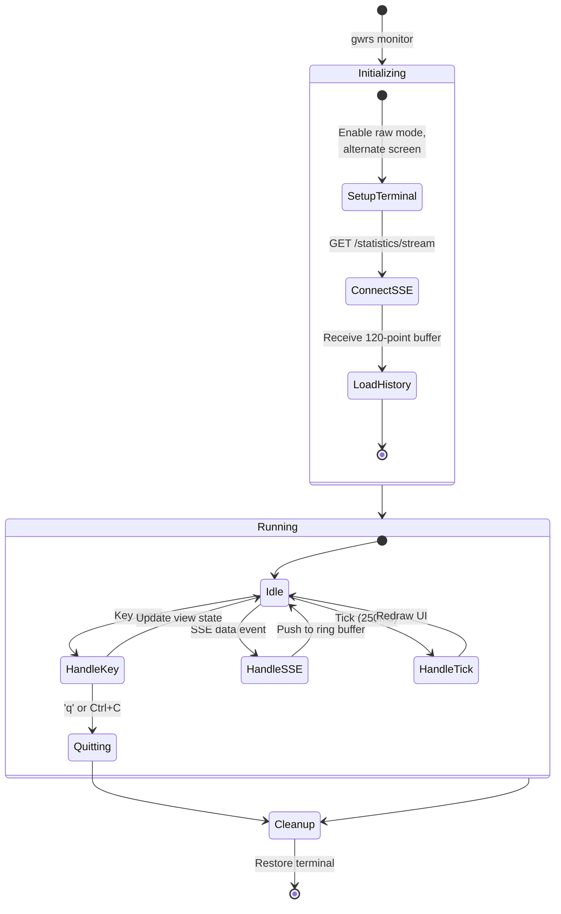
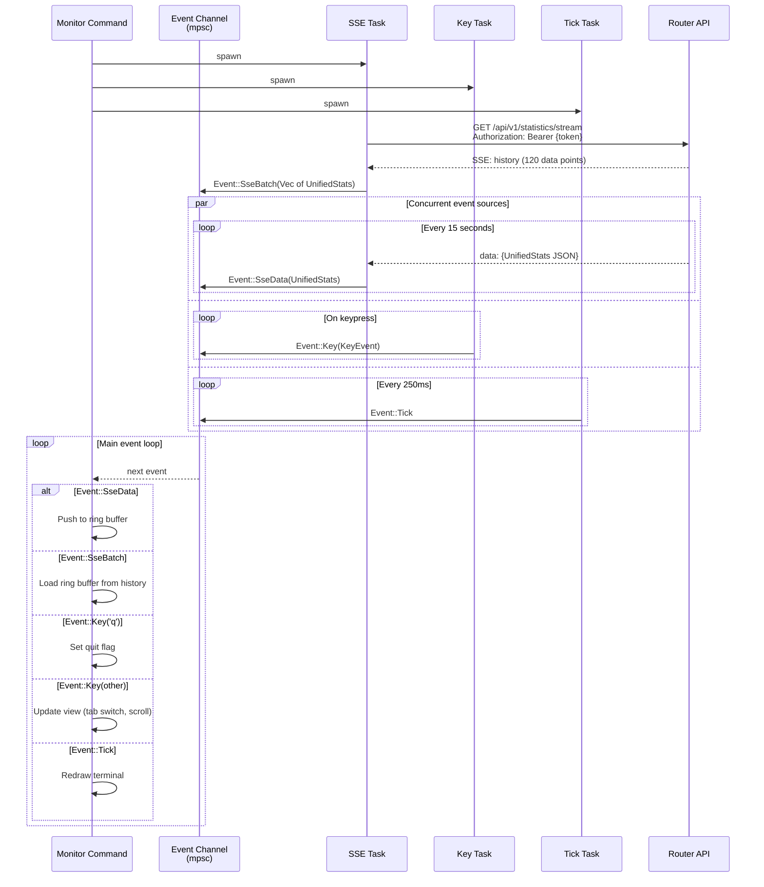
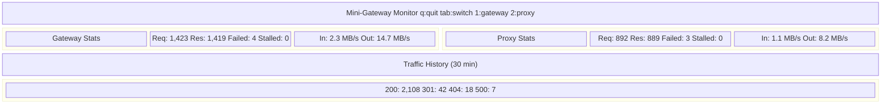
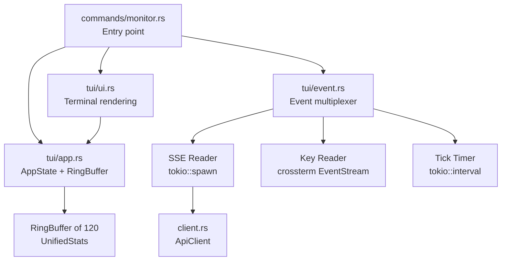

# ADR-0004: CLI Live Monitoring

## Date

2026-03-29

## Context

The project roadmap includes "CLI - Live Monitoring (looks like htop)" as an incomplete feature. The Router API already provides a Server-Sent Events (SSE) endpoint at `GET /api/v1/statistics/stream` that broadcasts `UnifiedStats` every 15 seconds and delivers a 120-point history buffer on initial connection.

The SSE payload contains per-interval metrics for both gateway and proxy targets:

```rust
UnifiedStats {
    ts: String,                          // ISO-8601 timestamp
    gateway: TargetStats { ... },
    proxy: TargetStats { ... },
}

TargetStats {
    req: i64,                            // Request count
    res: i64,                            // Response count
    bytes_in: i64, bytes_out: i64,       // Traffic volume
    bytes_in_min/max: i64, bytes_in_avg: f64,  // Bandwidth stats
    bytes_out_min/max: i64, bytes_out_avg: f64,
    status: HashMap<String, i64>,        // Status code distribution
    failed: i64,                         // Failed requests
    stalled_count: i64,                  // Requests awaiting response
}
```

This data is sufficient for a real-time terminal dashboard. The CLI already has `crossterm` (with `event-stream` feature) and `tokio` as workspace dependencies, providing the building blocks for async terminal UI.

This ADR depends on the architecture established in [ADR-0002](0002-cli-architecture-redesign.md).

## Architecture

### TUI Event Loop

The monitoring command must handle three concurrent event sources without blocking:

1. **SSE data**: New stats arriving every ~15 seconds from the API
2. **Keyboard input**: User pressing keys (quit, switch panels, scroll)
3. **UI tick**: Periodic screen refresh (every 250ms for smooth rendering)



### SSE Data Flow



### TUI Layout



The actual terminal rendering will look like:

```
 Mini-Gateway Monitor                    q:quit  tab:switch  1:gw  2:px
+------------------------+------------------------+
| GATEWAY                | PROXY                  |
| Req: 1,423  Res: 1,419 | Req: 892    Res: 889   |
| Failed: 4  Stalled: 0  | Failed: 3   Stalled: 0  |
| In:  2.3 MB  Out: 14.7 MB | In:  1.1 MB  Out: 8.2 MB |
+------------------------+------------------------+
| Traffic (last 30 min)                            |
| bytes_in  ▁▂▃▅▇█▇▅▃▂▁▂▃▅▇█▇▅▃▂▁▂▃▅▇█▇▅▃▂▁▂▃▅ |
| bytes_out ▁▁▂▃▅▆▇▇▆▅▃▂▁▁▂▃▅▆▇▇▆▅▃▂▁▁▂▃▅▆▇▇▆▅ |
+--------------------------------------------------+
| Status: 200:2108  301:42  404:18  500:7           |
| Connected: ws://localhost:24042  Last: 14:32:15   |
+--------------------------------------------------+
```

### Module Structure



## Decision

### 1. Command interface

```
gwrs monitor [--interval <ms>] [--url <api-url>]
```

- Launches the fullscreen TUI dashboard.
- `--interval` overrides the UI tick rate (default: 250ms). The SSE data rate is server-controlled at 15 seconds and cannot be changed from the client.
- Authentication uses the same credential resolution as all other commands (--user/--pass, --osenv, or cached token).

### 2. TUI framework: ratatui over raw crossterm

While `crossterm` is already a workspace dependency, using it directly for layout, charts, and widgets requires significant boilerplate. We recommend adding `ratatui` (which builds on crossterm) because:

- Provides layout primitives (split horizontal/vertical), border rendering, and text alignment out of the box.
- Has built-in chart widgets (Sparkline, BarChart) that directly map to our traffic visualization needs.
- Is the de facto standard for Rust TUI applications, well-maintained, and lightweight.
- Does not replace crossterm; it wraps it. The `crossterm` workspace dependency remains valid.

**New dependency**: `ratatui` (with `crossterm` backend, which is the default).

### 3. Async event multiplexer

Three `tokio::spawn` tasks feed into a single `tokio::sync::mpsc` channel:

```rust
enum Event {
    /// Single stats update from SSE stream
    SseData(UnifiedStats),
    /// Batch of historical stats on initial SSE connection
    SseBatch(Vec<UnifiedStats>),
    /// Keyboard input
    Key(crossterm::event::KeyEvent),
    /// UI refresh tick
    Tick,
    /// SSE connection lost
    SseDisconnected(String),
}
```

The main loop receives events and dispatches to the appropriate handler. This design keeps the event sources decoupled: if the SSE connection drops, the UI continues responding to keyboard input and displays a "disconnected" status.

### 4. Ring buffer (120 points)

The server maintains a 120-point history buffer and delivers it on SSE connection. The TUI mirrors this with a `VecDeque<UnifiedStats>` capped at 120 entries:

- On initial connection: populate from the history batch
- On each new SSE event: push to back, pop from front if at capacity
- The sparkline chart reads the last N entries (fitting terminal width)

At 15-second intervals, 120 points represents 30 minutes of data.

### 5. Graceful degradation

- **SSE disconnect**: Display "Disconnected" in the status bar, attempt reconnection every 5 seconds, keep the last known data on screen.
- **Terminal resize**: Detect `crossterm::event::Event::Resize`, recalculate layout, redraw.
- **Auth expiry**: If the SSE stream returns 401, re-authenticate using cached credentials and reconnect.

### 6. Keyboard controls

| Key | Action |
|-----|--------|
| `q` / `Ctrl+C` | Quit |
| `Tab` | Cycle focus between gateway and proxy panels |
| `1` | Focus gateway panel |
| `2` | Focus proxy panel |

## Consequences

### Positive

- Real-time visibility into gateway/proxy health without leaving the terminal.
- The 120-point history provides immediate context on connect (no need to wait 30 minutes for data).
- Decoupled event architecture means the UI stays responsive even during SSE disconnects.
- ratatui provides production-quality chart widgets, reducing custom rendering code.

### Negative

- Adds `ratatui` as a new dependency to the workspace.
- The TUI module is the most complex part of the CLI crate, significantly more code than all CRUD commands combined.
- Terminal rendering varies across terminal emulators; may need cross-platform testing.

### Risks

- **SSE protocol compatibility**: The SSE endpoint uses Actix-web's streaming response. The client must correctly parse `data:` lines and handle `event:` prefixes, keep-alive pings, and reconnection. Using `reqwest`'s `bytes_stream()` and parsing manually is straightforward but must handle edge cases (partial lines, multi-line data fields).
- **Terminal state corruption**: If the process crashes without restoring terminal state, the user's terminal is left in raw mode. Mitigated by using `std::panic::set_hook` to restore terminal on panic, and `ctrlc` handler for signal-based exit.

## Alternatives Considered

**Raw crossterm without ratatui**: Full control, no extra dependency. Rejected because implementing chart rendering (sparklines), layout splitting, and border drawing manually is substantial effort for marginal benefit. ratatui wraps crossterm; it does not replace it.

**Web-based dashboard only**: The Web GUI already provides monitoring. Rejected because the roadmap explicitly calls for CLI-based monitoring, and terminal workflows are common for operators managing headless servers.

**Polling instead of SSE**: Periodically call a REST endpoint for stats. Rejected because the SSE endpoint already exists, provides history on connect, and is more efficient than polling (single long-lived connection vs. repeated request/response cycles).

**tui-rs (unmaintained)**: The predecessor to ratatui. Rejected because ratatui is its actively maintained fork.

## References

- [ADR-0002](0002-cli-architecture-redesign.md): CLI Architecture (async runtime, module structure)
- [ADR-0003](0003-cli-control-panel.md): CLI Control Panel (shared auth and API client)
- router-api/src/api/statistics/unified_stats.rs: UnifiedStats and TargetStats struct definitions
- router-api/src/api/statistics/unified_stream.rs: SSE broadcaster implementation (15s interval, 120-point history)
- [ratatui documentation](https://ratatui.rs/)
