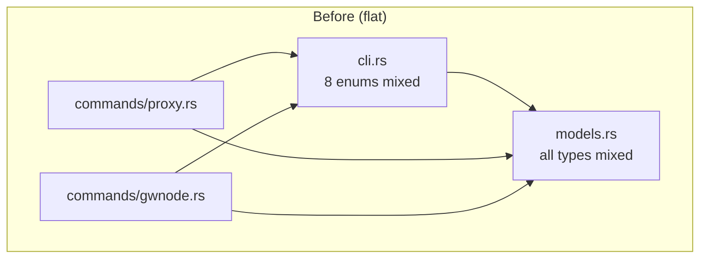
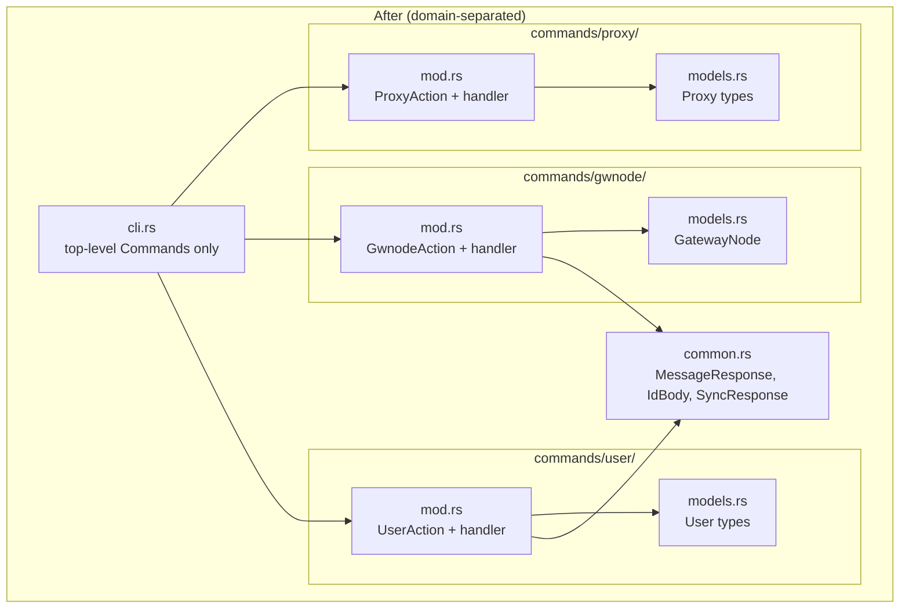
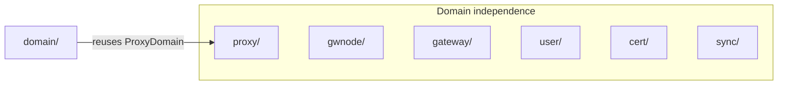

# ADR-0005: CLI Domain Separation

## Date

2026-03-29

## Context

After implementing the CLI control panel (ADR-0003), the codebase had three files that grew with every new resource:

- `cli.rs` (300+ lines): All subcommand enums for every resource mixed together
- `models.rs` (150+ lines): Every API request/response type in one file
- Each command handler imported types from both

Adding a new resource (e.g. `gwrs log`) required touching cli.rs (add enum), models.rs (add types), and commands/ (add handler). Three files for one concern.

## Architecture







## Decision

Restructure into domain-separated folders where each resource owns its CLI definition, models, and handler:

```
commands/
  proxy/
    mod.rs      -- ProxyAction enum + handler
    models.rs   -- Proxy, ProxyDomain, ProxyDetail, etc.
  domain/
    mod.rs      -- DomainAction enum + handler (reuses proxy/models::ProxyDomain)
  gwnode/
    mod.rs + models.rs
  gateway/
    mod.rs + models.rs
  user/
    mod.rs + models.rs
  cert/
    mod.rs + models.rs
  sync/
    mod.rs      -- no models, uses common::SyncResponse
  init.rs, config.rs, export.rs, monitor.rs  -- unchanged (no domain models)
```

Shared types (`MessageResponse`, `IdBody`, `SyncResponse`) move to `common.rs` at the crate root. `cli.rs` shrinks to only the top-level `Cli` struct and `Commands` enum, referencing each domain's action enum.

## Consequences

### Positive

- Adding a new resource means creating one folder. No changes to existing files.
- Each domain is self-contained: CLI args, types, and logic live together.
- Domains don't cross-reference each other (except domain/ reusing proxy/models, which is a real data relationship).
- Deleting a resource means deleting a folder.

### Negative

- More files and directories.
- Imports become slightly longer (`commands::proxy::ProxyAction` vs `cli::ProxyAction`).

### Risks

- If two domains start sharing types heavily, `common.rs` could grow. Mitigated by keeping only truly shared types there.

## References

- [ADR-0002](0002-cli-architecture-redesign.md): Original module structure this supersedes
- [ADR-0003](0003-cli-control-panel.md): CRUD commands that drove the growth
