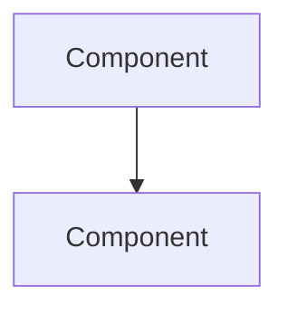

# ADR-NNNN: Title

## Date

YYYY-MM-DD

## Context

What is the issue that we're seeing that motivates this decision or change?

## Architecture

> Mermaid diagram(s) illustrating the component interaction, data flow, or state transitions relevant to this decision. Choose the appropriate diagram type(s): component, sequence, flowchart, or state diagram.

## Decision

What is the change that we're proposing and/or doing?

## Consequences

### Positive

- ...

### Negative

- ...

### Risks

- ...

## Alternatives Considered

What other options were evaluated and why were they rejected?

## References

- Links to related ADRs, issues, or external resources.
